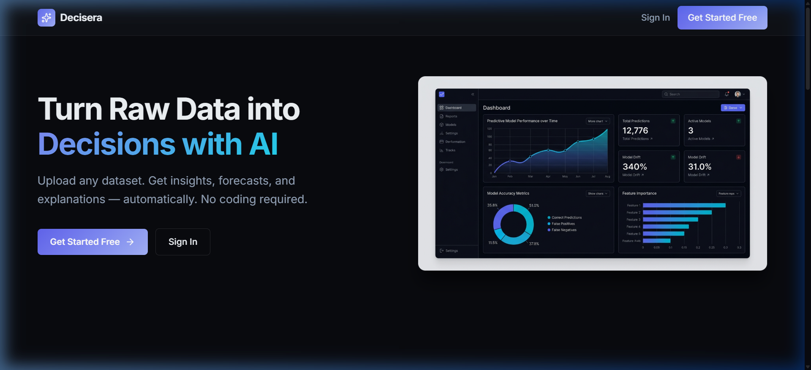
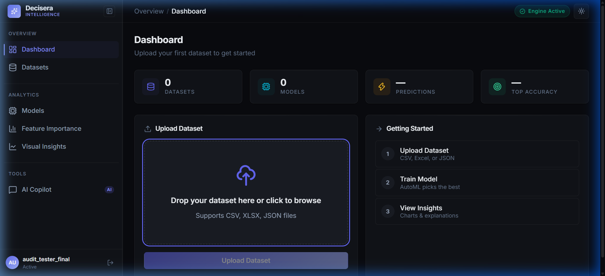
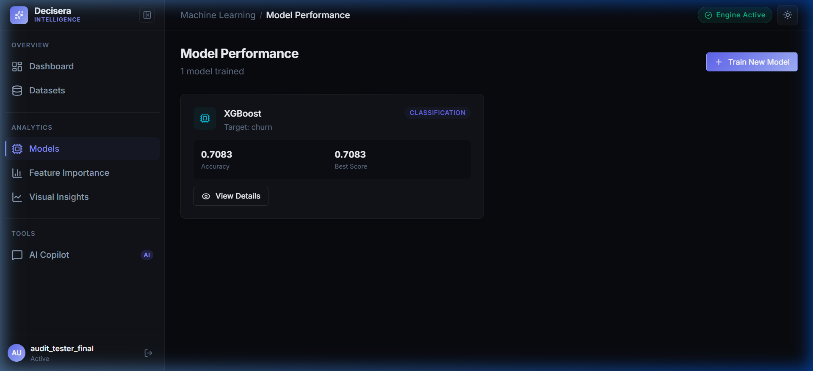
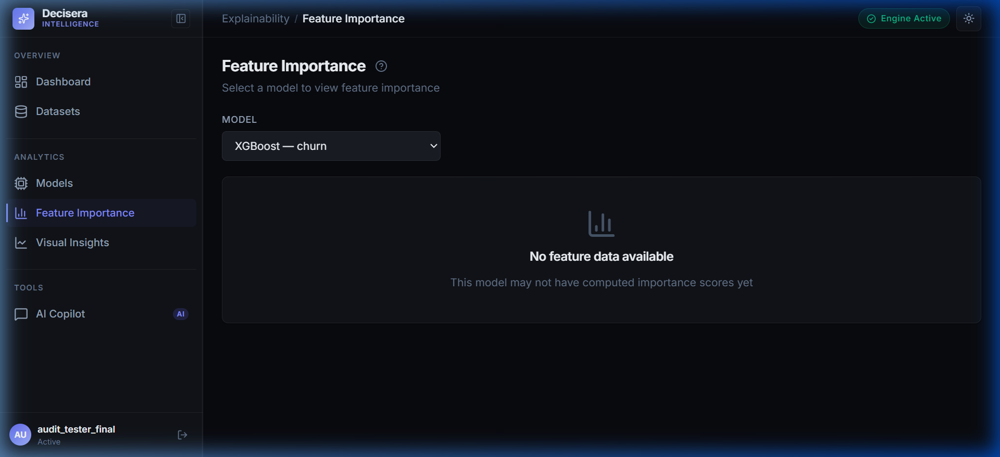

# Decisera — AI Decision Intelligence Platform

> **Enterprise-grade machine learning and decision intelligence platform that automates tabular ML workflows, generates explainable SHAP insights, and provides an AI Copilot for natural language dataset exploration.**

[](https://github.com/josephkamau32/AI-Decision-Intelligence-System/actions/workflows/ci.yml)
[](LICENSE)
[](https://decisera.vercel.app)
[](https://www.python.org/downloads/)
[](https://reactjs.org/)
[](https://www.typescriptlang.org/)
[](docker-compose.yml)

---

## 🌐 Live Demo

Experience the platform live in production:

🔗 **[https://decisera.vercel.app](https://decisera.vercel.app)**

> **⚡ Cold Start Notice:** The backend is deployed on Render's free tier and automatically suspends when idle. If the instance is sleeping, the first API request or page load may take up to **~50 seconds** to boot; the frontend displays a real-time status banner while waiting. Subsequent requests execute with sub-second response times.

### Demo Access & Authentication
- **Self-Registration Enabled:** Anyone can create an account immediately. Navigate to the [Registration Page](https://decisera.vercel.app/register) or click **"Get Started Free"** on the landing page to register your credentials. No administrator pre-approval is required.
- **Pre-configured Demo Workspace:** Once registered and logged in, you can instantly upload sample CSV datasets, trigger automated model training, evaluate SHAP explainability charts, or converse with the AI Copilot.

---

## 📸 Platform Tour

Real, unedited screenshots from the running application:

### 1. Landing & Navigation
Modern, accessible landing page presenting the core value proposition, architecture summary, and real-time backend health diagnostics.



---

### 2. Analytics Dashboard
Central command center tracking total datasets, active models, prediction metrics, automated data quality profiling, and recent ML runs.



---

### 3. Automated Model Performance & Evaluation
Multi-model benchmarking engine evaluating 12+ algorithms across classification, regression, and time-series tasks with interactive metrics and confusion matrices.



---

### 4. Explainable AI & SHAP Feature Attribution
TreeSHAP and KernelSHAP visualizer uncovering global feature importance rankings, decision thresholds, and per-feature impact directions.



---

## 🏗️ Architecture Overview

Decisera is built with a decoupled, cloud-native client-server architecture:

```
┌─────────────────────────────────────────────────────────────┐
│             Frontend: React 18 + TypeScript (Vercel)        │
│  - Precision Foundry Design System (WCAG AA compliant)     │
│  - Plotly.js Interactive Analytics & SHAP Visualizations    │
│  - Asynchronous Axios client with cold-start health probe   │
└──────────────────────────────┬──────────────────────────────┘
                               │ HTTPS / JSON REST
                               ▼
┌─────────────────────────────────────────────────────────────┐
│               Backend: FastAPI + Python 3.11 (Render)       │
│  - Pydantic v2 schemas & strict type validation             │
│  - JWT Bearer Authentication & PBKDF2 / Bcrypt hashing      │
│  - Background task scheduling & Redis caching layers        │
└──────────────────────────────┬──────────────────────────────┘
                               │
            ┌──────────────────┴──────────────────┐
            ▼                                     ▼
┌───────────────────────────────┐   ┌───────────────────────────────┐
│     AutoML & Analytics Engine │   │   AI Copilot & Monitoring     │
│  - Scikit-learn, XGBoost      │   │  - Google Gemini Generative AI│
│  - LightGBM, CatBoost         │   │  - MLflow Experiment Lineage  │
│  - Prophet, PyTorch LSTM      │   │  - Prometheus /metrics        │
│  - Optuna Hyperparameter Tuner│   │  - Grafana Pre-built Panels   │
│  - TreeSHAP & KernelSHAP      │   │  - Redis In-Memory Cache      │
└───────────────────────────────┘   └───────────────────────────────┘
```

The system operates across three decoupled layers:
1. **Frontend (React 18 + TypeScript):** Hosted on Vercel Edge. Employs the bespoke *Precision Foundry* tokenized design system (Obsidian dark palette, Lucide icons, responsive sidebar rail) and communicates via an authenticated REST API client.
2. **Backend (FastAPI + Python 3.11):** Hosted on Render. Provides asynchronous REST endpoints with Pydantic v2 validation, JWT authentication, and automated task execution.
3. **ML Pipeline & MLOps:** Coordinates 12+ ML models (XGBoost, LightGBM, CatBoost, RandomForest, Prophet, PyTorch LSTM) with Optuna hyperparameter optimization, SHAP explainability, Redis caching, MLflow tracking, and Prometheus metrics.

---

## 💻 Local Setup & Development

Follow these verified steps to run the complete stack locally from source.

### Prerequisites
- **Python 3.11+**
- **Node.js 18+** & npm
- **Git**
- Optional: **Docker** & **Docker Compose**

### 1. Clone the Repository
```bash
git clone https://github.com/josephkamau32/AI-Decision-Intelligence-System.git
cd AI-Decision-Intelligence-System
```

### 2. Backend Setup
```bash
# Create and activate virtual environment
python -m venv .venv

# On Windows:
.venv\Scripts\activate
# On Linux / macOS:
source .venv/bin/activate

# Install production dependencies
pip install -r requirements.txt

# (Optional) Install development and testing dependencies:
pip install -r requirements-dev.txt

# Create local environment file from template
cp .env.example .env

# Configure required keys in .env:
# - SECRET_KEY & JWT_SECRET_KEY (generate via: python -c "import secrets; print(secrets.token_urlsafe(32))")
# - GOOGLE_API_KEY (optional, for Gemini AI Copilot)
# - ALLOWED_ORIGINS="http://localhost:3000,http://127.0.0.1:3000"

# Launch FastAPI backend with hot-reload
uvicorn backend.api.main:app --reload --port 8000
```
- Backend API: `http://localhost:8000`
- Swagger Interactive Docs: `http://localhost:8000/docs`
- Health Endpoint: `http://localhost:8000/api/v1/health`
- Prometheus Metrics: `http://localhost:8000/metrics`

### 3. Frontend Setup
```bash
# In a new terminal window
cd frontend

# Install npm dependencies
npm install --legacy-peer-deps

# Create local environment configuration
cp .env.example .env
# Verify REACT_APP_API_URL is set:
# REACT_APP_API_URL=http://localhost:8000

# Start React development server
npm start
```
- Web Application: `http://localhost:3000`

---

## 🐳 Docker Deployment (End-to-End Verified)

The entire Decisera platform is containerized and verified to run end-to-end via Docker Compose.

```bash
# From project root:
docker compose up --build -d
```

### Verified Container Network & Ports
| Container | Image Tag | Host Port | Health Check |
|:---|:---|:---|:---|
| `backend` | `ai-decision-backend:latest` | `8000` | `curl -f http://localhost:8000/api/v1/health` (HTTP 200) |
| `frontend` | `ai-decision-frontend:latest` | `3000` | Nginx Static Server + Internal Network Routing |
| `redis` | `redis:alpine` | `6379` | `redis-cli ping` (PONG) |
| `mlflow` | `ghcr.io/mlflow/mlflow` | `5000` | Artifact & Experiment Registry |

### Verifying Container Health
```bash
# Check backend health from host:
curl -i http://localhost:8000/api/v1/health

# Verify frontend can communicate with backend inside the Docker network:
docker exec aidecisionintelligencesystem-frontend-1 wget -qO- http://backend:8000/api/v1/health
# Output: {"status":"healthy","version":"1.0.0","timestamp":"..."}
```

---

## 🧠 Engineering Notes & Tradeoffs

> *A transparent technical retrospective on architectural choices, tradeoffs, and production evolution.*

1. **Serverless Free-Tier Cold Starts vs. Dedicated Instances:**
   Deploying the backend on Render's free tier provides a cost-free continuous live demo, but incurs a ~50-second container spin-up penalty when cold. Heavy ML frameworks (PyTorch, scikit-learn, XGBoost, CatBoost, SHAP) require substantial import time and memory allocation during process initialization. Rather than disguising this delay, we engineered an asynchronous health-probing client in React with a transparent countdown alert. In an enterprise environment, we would separate the lightweight REST gateway (FastAPI on AWS Lambda / Cloud Run with provisioned concurrency) from a dedicated worker cluster (Celery / Ray on Kubernetes) to guarantee consistent sub-100ms API responses.

2. **Model Explainability: Precision vs. Computational Complexity:**
   We prioritized TreeSHAP for tree-based estimators (XGBoost, LightGBM, RandomForest) because it provides exact polynomial-time Shapley values for tabular decision trees. However, for neural architectures (LSTM) and arbitrary ensembles, KernelSHAP scales exponentially with feature dimension. To keep the interactive UI responsive under real-time constraints, we implemented background sampling approximations (median background clustering). With additional engineering time, we would implement asynchronous SHAP calculation jobs that stream attribution plots via WebSockets.

3. **Data Ingestion Robustness:**
   In early iterations, datasets containing mixed datetime strings, unencoded categorical levels, and high-cardinality ID columns caused pipeline failures. We redesigned `backend/ml/automl.py` with an automated preprocessing pipeline that enforces median numerical imputation, one-hot encoding for low-cardinality categoricals, datetime decomposition (year/month/day/hour), and automatic dropping of constant/ID columns before matrix hand-off to estimators.

4. **Persistent Database vs. Ephemeral Container Storage:**
   Render's free web services run on ephemeral containers that discard local disk files upon every deployment, manual redeploy, or idle spin-down. To ensure user accounts and credentials persist across redeploys, Decisera integrates with PostgreSQL via SQLAlchemy and `psycopg2-binary`, falling back to local SQLite in development. Note: Render's free PostgreSQL tier automatically expires 90 days after creation (provisioned September 5, 2026; expires December 4, 2026 unless upgraded to a paid persistent tier).

---

## 🧪 Testing & Quality Assurance

All commits are continuously validated via GitHub Actions on Ubuntu runners.

### Backend Test Suite
```bash
# Execute unit and integration tests
pytest -v

# Run with test coverage report
pytest -v --cov=backend/api --cov=backend/ml --cov=backend/services
```
*58 unit and integration tests passing with 0 errors across datasets, models, copilot mocking, persistent database storage, and data preprocessing.*

### Code Quality & Linters
```bash
# Black formatting check (88 character limit)
black --check backend/

# Flake8 style verification
flake8 backend/ --max-line-length=88 --extend-ignore=E203,W503

# Frontend TypeScript verification
cd frontend && npx tsc --noEmit
```

---

## 🔐 Security & RBAC

- **JWT Token Authentication:** Encrypted Bearer tokens with 30-minute expiration windows.
- **Password Security:** Cryptographic password hashing utilizing Bcrypt.
- **Role-Based Access Control:** Pre-configured roles (`Admin`, `User`, `Viewer`) restricting model deployment and dataset deletion permissions.
- **API Defense-in-Depth:** Configurable CORS origin whitelisting, HTTP security headers (HSTS, X-Frame-Options DENY, X-Content-Type-Options nosniff), and Pydantic v2 input sanitization.

---

## 📄 License

Distributed under the **MIT License**. See [`LICENSE`](LICENSE) for full details.

Copyright © 2026 **Joseph Kamau** ([@josephkamau32](https://github.com/josephkamau32)).