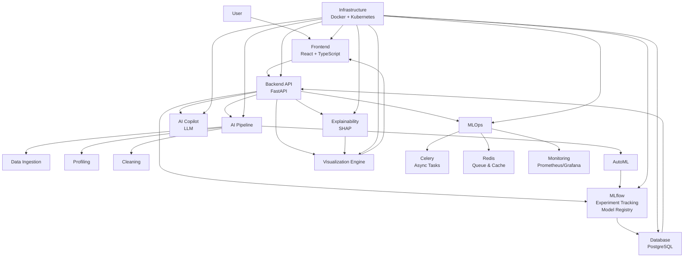

# AI Decision Intelligence Platform - System Architecture

## Overview
The AI Decision Intelligence Platform is designed to provide end-to-end AI capabilities for data-driven decision making. It integrates data processing, machine learning pipelines, model deployment, explainability, and user-friendly interfaces. The architecture emphasizes modularity, scalability, and robustness, leveraging modern technologies for AI operations.

## System Components

### 1. Frontend (React + TypeScript)
- **Purpose**: User interface for system interaction, data visualization, pipeline configuration, and AI copilot access.
- **Technologies**: React for component-based UI, TypeScript for type safety.
- **Interactions**: Communicates with Backend API via RESTful calls.

### 2. Backend API (FastAPI)
- **Purpose**: Central orchestration layer handling API requests, business logic, and integration with AI components.
- **Technologies**: FastAPI for asynchronous, high-performance Python API.
- **Interactions**: Receives requests from Frontend, delegates to AI Pipeline, MLflow, etc.

### 3. AI Pipeline
- **Purpose**: Automated data processing and model training workflow.
- **Sub-components**:
  - **Data Ingestion**: Handles batch uploads and real-time streaming data.
  - **Profiling**: Generates data statistics, quality metrics, and anomaly detection.
  - **Cleaning**: Preprocesses data (handling missing values, normalization, feature engineering).
  - **AutoML**: Automated model selection, training, and hyperparameter optimization.
- **Technologies**: Python libraries (Pandas, Scikit-learn, etc.).
- **Interactions**: Triggered by Backend API, outputs models to MLflow.

### 4. MLflow Integration
- **Purpose**: Experiment tracking, model versioning, and registry.
- **Technologies**: MLflow for MLOps lifecycle management.
- **Interactions**: Stores models from AI Pipeline, serves models for inference.

### 5. AI Copilot (LLM)
- **Purpose**: Intelligent assistant for user guidance, query answering, and automated suggestions.
- **Technologies**: Integration with LLM APIs (e.g., OpenAI GPT).
- **Interactions**: Accessed via Backend API, provides contextual responses.

### 6. Visualization Engine
- **Purpose**: Generates interactive charts, dashboards, and reports for data insights and model performance.
- **Technologies**: Libraries like Plotly, D3.js, or integrated with React.
- **Interactions**: Pulls data from Backend API or database, renders in Frontend.

### 7. Explainability (SHAP)
- **Purpose**: Provides model interpretability and explanations for predictions.
- **Technologies**: SHAP library for explainable AI.
- **Interactions**: Applied to models during inference, results displayed via Visualization Engine.

### 8. MLOps
- **Purpose**: Operational management of ML workflows.
- **Sub-components**:
  - **Celery**: Asynchronous task queue for long-running jobs (e.g., training, batch inference).
  - **Redis**: Message broker and caching layer.
  - **Monitoring**: Logging, metrics collection, and alerting.
- **Technologies**: Celery for distributed tasks, Redis for queuing, Prometheus/Grafana for monitoring.
- **Interactions**: Backend API queues tasks to Celery via Redis.

### Additional Components
- **Database**: Stores application data, user sessions, metadata (e.g., PostgreSQL).
- **Model Registry**: Integrated with MLflow for model storage and versioning.
- **Infrastructure**: Docker for containerization, Kubernetes for orchestration.

## Architecture Diagram

## Data Flow

1. **Data Input**: Users upload data via Frontend, sent to Backend API, ingested into AI Pipeline.
2. **Processing**: Data flows through Profiling → Cleaning → AutoML, generating models.
3. **Model Management**: Models registered in MLflow, versioned and tracked.
4. **Inference**: Real-time requests via API, batch jobs via Celery. Results explained with SHAP.
5. **Output**: Visualizations and insights delivered to Frontend.
6. **Async Processing**: Long tasks (e.g., training) queued in Celery/Redis for background execution.

## Scalability Considerations

- **Horizontal Scaling**: Use Kubernetes to scale pods for Backend, AI Pipeline, and MLOps components based on load.
- **Load Balancing**: Ingress controllers distribute traffic.
- **Resource Management**: Auto-scaling groups for compute-intensive tasks like AutoML.
- **Data Scalability**: Distributed databases or data lakes for large datasets.
- **Caching**: Redis for frequently accessed data and model predictions.

## Monitoring Strategies

- **Metrics**: Prometheus collects system and application metrics (CPU, memory, request latency).
- **Visualization**: Grafana dashboards for real-time monitoring.
- **Logging**: Centralized logging with ELK stack (Elasticsearch, Logstash, Kibana) for troubleshooting.
- **Alerting**: Automated alerts for anomalies, failures, or performance degradation.
- **Tracing**: Distributed tracing for request flows across components.

## Tradeoffs

- **Real-time vs. Batch Inference**:
  - Real-time: Low latency for immediate decisions, but higher resource usage and potential throttling.
  - Batch: Efficient for large volumes, cost-effective, but introduces delays.
  - Decision: Hybrid approach - real-time for critical paths, batch for analytics.

- **Async Processing**: Improves responsiveness by offloading tasks to Celery, but adds complexity in error handling and state management.

- **Technology Choices**: FastAPI chosen for async capabilities over Flask; React for rich UI over vanilla JS; Docker/K8s for portability and scaling over bare-metal.

## API Endpoints Overview

The platform exposes RESTful APIs organized by functionality:

### Health & Monitoring
- `GET /api/v1/health` - System health check
- `GET /api/v1/monitoring/metrics` - Application metrics

### Dataset Management
- `POST /api/v1/datasets/upload` - Upload dataset files
- `GET /api/v1/datasets/` - List all datasets

### Model Management
- `POST /api/v1/models/train` - Initiate model training
- `GET /api/v1/models/train/{training_id}` - Get training status
- `POST /api/v1/models/inference` - Real-time inference
- `POST /api/v1/models/batch-inference` - Batch inference

### AI Copilot
- `POST /api/v1/copilot/query` - Query the AI assistant

### Visualizations
- `GET /api/v1/visualizations/{type}` - Generate various charts and plots

All endpoints support JSON request/response formats and include comprehensive error handling and validation.

## Architectural Decisions and Rationale

- **Microservices Architecture**: Components are loosely coupled, allowing independent scaling and development. Chosen for flexibility in AI workflows.
- **FastAPI for Backend**: Supports async operations, auto-generated docs, high performance for AI workloads.
- **MLflow Integration**: Industry standard for MLOps, simplifies model lifecycle management.
- **SHAP for Explainability**: Open-source, widely adopted for interpretable AI, integrates well with Python ecosystem.
- **Celery + Redis**: Robust for distributed task queuing, Redis provides fast caching.
- **Docker + Kubernetes**: Ensures consistency across environments, enables cloud-native deployments.
- **React + TypeScript**: Type safety reduces bugs, component reusability for complex UIs.
- **Database Choice**: PostgreSQL for relational data; could extend to NoSQL for unstructured data if needed.

This architecture provides a solid foundation for an AI Decision Intelligence Platform, balancing performance, scalability, and maintainability.